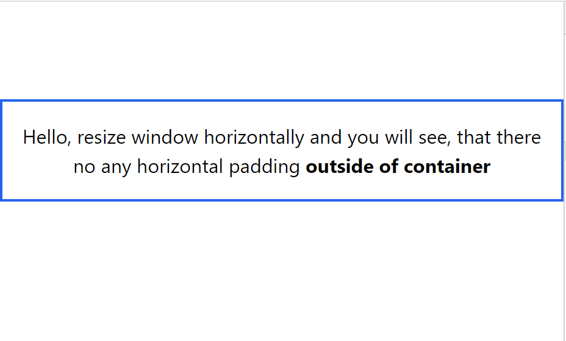

# WindiCSS Issue - `container`

In `tailwind.config.ts` we have:

```ts
import { defineConfig } from 'vite-plugin-windicss'

export default defineConfig({
    theme: {
        container: {
            padding: "30px",
            center: true,
        },
    }
})
```

In [Tailwind CSS docs](https://tailwindcss.com/docs/container#horizontal-padding) we have:

> To add horizontal padding by default, specify the amount of padding you'd like using the padding option in the theme.container section of your config file:

```js
// tailwind.config.js
module.exports = {
  theme: {
    container: {
      padding: '2rem',
    },
  },
}
```

In this demo we have:



To run demo:

```sh
npm install
npm run dev

# or

pnpm i
pnpm dev

# or

yarn
yarn dev

# etc
```

